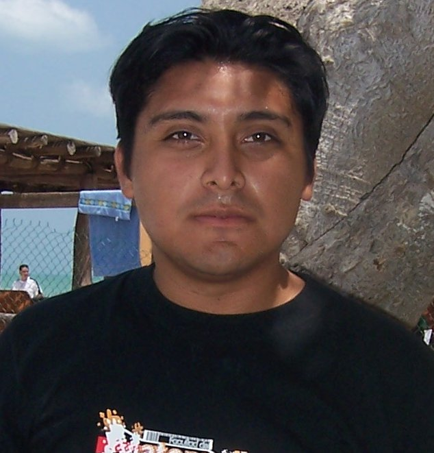

# OAW
# FeedRss

Repositorio para el proyecto final de la asignatura optativa  
Optimización de Aplicaciones Web.  
Segunda entrega del Lector de Noticas FeedRss

Profesor: Dr. Víctor Hugo Menéndez Domínguez 

 Equipo:
  
  
  
* Francisco Javier Camas Tec.
